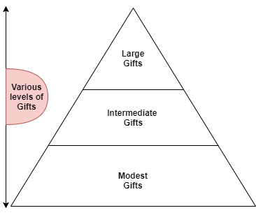

class: inverse, middle


# Content
------------------------------

+ ### Introduction to Nonprofit Organizations
+ ### Non-governemental Organizations 
+ ### Fundraising Principles
+ ### Fundraising Planning 
  + ### Fundraising Audit 
     


---

class: inverse, center, middle

# Introduction to NonProfit Organizations

---

### Introduction to Nonprofit Organizations 
-------------------------------------------

```{r, include=FALSE}
library(tidyverse)

```


<center>

```{r, echo = FALSE}

library(DiagrammeR)
grViz("
digraph boxes_and_circles  {

graph [overlap = true]

node [shape = box,
      style = filled,
      color = grey, 
      fixedsize = true, 
      width = 0.9, 
      height = 0.6, 
      fontsize = 15]


node [fillcolor = DarkTurquoise, label = 'Society']
Society

node [fillcolor = DarkTurquoise, label = 'Public']
Public

node [fillcolor = DarkTurquoise, label = 'Corporate']
Corporate

node [fillcolor = MediumSpringGreen, label = 'Nonprofit']
Nonprofit

edge [color = grey]
Society -> Public 
Society -> Corporate
Society -> Nonprofit 


}")

```


---

### Introduction to Nonprofit Organizations
-------------------------------------------

<center> 


```{r, echo = FALSE}
library(DiagrammeR)
grViz("
digraph boxes_and_circles  {

graph [overlap = true]

node [shape = box,
      style = filled,
      color = grey, 
      fixedsize = true, 
      width = 0.9, 
      height = 0.6, 
      fontsize = 15]


node [fillcolor = DarkTurquoise, label = 'Society']
Society

node [fillcolor = DarkTurquoise, label = 'Public']
Public

node [fillcolor = DarkTurquoise, label = 'Corporate']
Corporate

node [fillcolor = MediumSpringGreen, label = 'Nonprofit']
Nonprofit

node [fillcolor = Honeydew, label = 'NGOs', 
shape = circle, width = 0.5, height = 0.5, fontsize = 10]
NGOs

edge [color = grey]
Society -> Public 
Society -> Corporate
Society -> Nonprofit 

NGOs -> Nonprofit [arrowhead=none, color = MediumSpringGreen]


}")

```


---


### Introduction to Nonprofit Organizations
-------------------------------------------

<center> 


```{r, echo = FALSE}
library(DiagrammeR)
grViz("
digraph boxes_and_circles  {

graph [overlap = true]

node [shape = circle,
      style = filled,
      color = grey, 
      width = 0.1, 
      height = 0.1, 
      fontsize = 2]


node [fillcolor = MediumSpringGreen, label = 'Nonprofit',
shape = box, width = 0.3, height = 0.1,  fontsize = 10]
Nonprofit

node [fillcolor = Honeydew, label = 'NGOs', shape = plaintext, 
width = 0.2, height = 0.1,  fontsize = 10]
NGOs

node [fillcolor = Honeydew, label = 'Foundations', shape = plaintext, 
width = 0.2, height = 0.1,  fontsize = 10]
Foundations

node [fillcolor = Honeydew, label = 'Associations', shape = plaintext, 
width = 0.2, height = 0.1,  fontsize = 10]
Associations

node [fillcolor = Honeydew, label = 'Unions', shape = plaintext, 
width = 0.2, height = 0.1,  fontsize = 10]
Unions


node [fillcolor = Honeydew, label = 'Charities', shape = plaintext, 
width = 0.2, height = 0.1,  fontsize = 10]
Charities

node [fillcolor = Honeydew, label = 'Social movements', shape = plaintext, 
width = 0.2, height = 0.1,  fontsize = 10]
Social_movements


edge [color = grey]
 
NGOs -> Nonprofit [arrowhead=none, color = MediumSpringGreen]

Foundations -> Nonprofit [arrowhead=none, color = MediumSpringGreen]

Associations -> Nonprofit [arrowhead=none, color = MediumSpringGreen]

Nonprofit-> Unions [arrowhead=none, color = MediumSpringGreen]

Nonprofit-> Charities  [arrowhead=none, color = MediumSpringGreen]

Nonprofit-> Social_movements  [arrowhead=none, color = MediumSpringGreen]


}")

```

---


### Introduction to Nonprofit Organizations
-------------------------------------------
<center>


```{r, echo=FALSE}
DiagrammeR::grViz("digraph {
  graph [layout = dot, rankdir = TB]
  
  node [shape = rectangle, style = filled]        
  rec1 [label = 'Nonprofit Sector', fillcolor = MediumSpringGreen]
  rec2 [label = 'Prohibition of Profit Distribution', fillcolor = Honeydew, shape = oval]
  
  
  # edge definitions with the node IDs
  
  edge [arrowhead = none]
  
  rec1 -> rec2 
  }", 
  height = 500)
```


---

### Introduction to Nonprofit Organizations
-------------------------------------------


<center>


```{r, echo=FALSE}
DiagrammeR::grViz("digraph {
  graph [layout = dot, rankdir = TB]
  
  node [shape = rectangle, style = filled]        
  rec1 [label = 'Nonprofit Sector', fillcolor = MediumSpringGreen]
  rec2 [label = 'Prohibition of Profit Distribution', fillcolor = Honeydew, shape = oval]
  rec3 [label = 'Serve a Public Purpose', fillcolor = Honeydew, shape = oval]

  
  # edge definitions with the node IDs
  
  edge [arrowhead = none]
  
  rec1 -> rec2  -> rec3
  }", 
  height = 500)
```


---


### Introduction to Nonprofit Organizations
-------------------------------------------


<center>


```{r, echo=FALSE}
DiagrammeR::grViz("digraph {
  graph [layout = dot, rankdir = TB]
  
  node [shape = rectangle, style = filled]        
  rec1 [label = 'Nonprofit Sector', fillcolor = MediumSpringGreen]
  rec2 [label = 'Prohibition of Profit Distribution', fillcolor = Honeydew, shape = oval ]
  rec3 [label = 'Serve a Public Purpose', fillcolor = Honeydew, shape = oval]
  rec4 [label = 'Volunteering', fillcolor = Honeydew, shape = oval]


  
  # edge definitions with the node IDs
  
  edge [arrowhead = none]
  
  rec1 -> rec2  -> rec3 -> rec4 
  }", 
  height = 500)
```


---

### Introduction to Nonprofit Organizations
-------------------------------------------


<center>


```{r, echo=FALSE}
DiagrammeR::grViz("digraph {
  graph [layout = dot, rankdir = TB]
  
  node [shape = rectangle, style = filled]        
  rec1 [label = 'Nonprofit Sector', fillcolor = MediumSpringGreen]
  rec2 [label = 'Prohibition of Profit Distribution', fillcolor = Honeydew, shape = oval ]
  rec3 [label = 'Serve a Public Purpose', fillcolor = Honeydew, shape = oval]
  rec4 [label = 'Volunteering', fillcolor = Honeydew, shape = oval]
  rec5 [label = 'Private', fillcolor = Honeydew, shape = oval]


  
  # edge definitions with the node IDs
  
  edge [arrowhead = none]
  
  rec1 -> rec2  -> rec3 -> rec4 -> rec5
  }", 
  height = 500)
```


---

class: inverse, center, middle

#  NonGovernmental Organisations NGOs

---

### NGOs: Origin of the term 
https://www.un.org/en/sections/un-charter/chapter-x/index.html

<center> 


---

# Definitions 

<strong> 

> Any non-profit, non-violent, organized group of people who do not seek government functions. (Willetts, 1996)

-----------------------------------------------------------------
<br>


<strong>
> NGOs include a wide variety of groups and institutions that are entirely or largely independent of government, and characterized primarily by humanitarian or cooperative, rather than commercial, objectives. (World Bank, 1989)

------------------------------
<br>
<strong> 
> An NGO is a private, voluntary, not-for-profit organization, supported at least in part by voluntary contributions from the public. (UNDP, 1996)

------------------------------

---

# Characteristics of NGOs
--------------------------

+ ### Non-profit oriented
+ ### Government independent 
+ ### Supported by volunteering
+ ### Structured Established organizations (not ephemeral or informal)
+ ### Non-violent

---
# Characteristics of NGOs
--------------------------


+ ### NGOs seeks civil society support and media awareness in order to influence state politics 

--


+ ### They do not seek political power directly.


---


.pull-left[


]

.pull-right[


]

---


class: inverse, center, middle

# NGOs Fundraising 


---

class: inverse, center, middle


# I. Fundraising Principles


---
# What is Fundraising ?

> ## Fundraising is a process that aims to collect and distribute wealth in order to have a positive sustainable impact on a public cause. 


---


### 1. People Give To People To Help ~~People~~ __causes__

-----------------------------------

  + ### Fundraising is value-based

  + ###Donors will act based on the feelings they have with the final recipient.
  
  + ###Donors invest in projects with a positive impact.
  
  + ###Institutions do not have needs, causes have -> Mission Statement

--

## The Paradox of Generosity

+ ### People feel happier, richer, and healthier after donating time and money to others. 

---

### 2. People Give Relative To Their Means And To What Others Give
-----------------------------------

 + ### Avoid schemes based on the “average gift.”
 
 + ### Pyramidal Planning ensures that everyone can donate.


<center>



---

### 3. Those Closest To The Organization Must Set The Pace

--------------------------------------------------------

+ ### The leadership begins with the board, the staff and the key volunteers.

+ ### As an example:

<center> 


--- 

---

### 3. Those Closest To The Organization Must Set The Pace

--------------------------------------------------------

## The Time-Ask Effect

+ ### If people are first asked to give their time to an organization, and only later asked to make a financial donation, they will give more of both (Lio and Aaker, 2008)

--

+ ### Thinking about money automatically activates concepts of individualism and self-focus (Vohs, Mead, and Goode, 2006)


---

## 4. The Six Rights 
-----------------------------------------------

### The six rights are the six critical success factors in any fundraising campaign.


.pull-left[

+ ### Who is the _right_  person that should ask for the contributions?
+ ### Determining the _right_  prospects.
+ ### What is the _right_ amount to request ?

]

.pull-right[
+ ### Choosing the _right_ project.
+ ### Determining the _right_ time.
+ ### What's the _right_ way ?


]
 


---

class: inverse, center, middle

#  Fundraising planning

---
# Where to Start ? 
----------------------------

### Organizations with a fundraising plan are likely to raise more money (Nonprofit Research Collaborative, 2014)

---

# Dimensions of Fundraising planning
-------------------------------------

<center> 


```{r, echo=FALSE}

library(DiagrammeR)

mermaid("
graph TB
  A(Where are we now ?) --> B(Where do we want to be ?)
  
  C --> A
  
  B--> C(How to get there ?)

  
", height = 500)

```


---

# Where are we now ? 
---------------------------------------------------------

<center> 

```{r, echo=FALSE}

library(DiagrammeR)

mermaid("
graph TB
  A(Where are we now ?) --> B(Mission Statement)
  
  A(Where are we now ?) --> C(Vision Statement)
  
", height = 500)

```

---

# The Vision Statement

+ ### The Vision is a clear statement of the world the nonprofit wants to see (Sargeant & Shang, 2010). 


+ ### It must define briefly what success will look like for the organization (Weinstein & Barden, 2017).


---

# The Mission Statement

+ ##The Mission Statement defines the mechanisms that will allow the organization to make its vision a reality.

 + ###Why does the organization exist ? 
 + ###Whom does it serve ?
 + ###What is the geographic range of its work ? 

---
# The Mission Statement


+ ##The Mission Statement must be formulated in a way that enables the organization to measure and evaluate its achievements. 


---
##### Source: https://help.worldwildlife.org/hc/en-us/articles/360007905494-WWF-s-Mission-Vision

.pull-left[


]

.pull-right[

##Vision:
+ _"Our vision is to build a future in which people live in harmony with nature. We seek to save a planet, a world of life."_

## Mission:

+ _"The mission of World Wildlife Fund is to conserve nature and reduce the most pressing threats to the diversity of life on Earth."_


]

---
# The Fundraising Audit 
-------------------------------------

<center> 

```{r, echo=FALSE, out.width=700}


DiagrammeR::mermaid("
graph TB
  A(Where are we now ?) --> B(Mission/Vision)
  
  A(Where are we now ?) --> C(Fundraising Audit)
  
  C --> D> An Analysis of the factors that may impact the fundraising success]
  
")

```

---

# The Fundraising Audit 
-------------------------------------
<center> 

```{r, echo=FALSE, out.width=700}

DiagrammeR::mermaid("
graph TB
  A[PEST Analysis] --- B(Political factors) --- C(Economic factors) --- D(Sociocultural factors) --- E(Technological factors)
")

```

---

background-image: url('geo.png')
background-size: cover

---

.pull-left[

```{r echo=FALSE, cache=TRUE}
library(gt)
final_data <- readRDS(file = "data.Rds")
final_data <- final_data %>% select(Country = economy, Score = overall_score)
final_data$Country <- toupper(final_data$Country) 

gt(final_data[1:10,]) %>% tab_header(title = "The highest overall scores", subtitle = "2018 data")


```

]

.pull-right[

```{r echo=FALSE, cache=TRUE}

final_data <- readRDS(file = "data.Rds")
final_data <- final_data %>% select(Country = economy, Score = overall_score)
final_data$Country <- toupper(final_data$Country) 

final_data <- final_data %>% arrange(Score)

gt(final_data[1:10, ]) %>% tab_header(title = "The lowest overall scores", subtitle = "2018 data")


```

]

---

# The Fundraising Audit 
-------------------------------------

<center> 
```{r, echo=FALSE, out.width=700}

DiagrammeR::mermaid("
graph TB
  A[Competitor Analysis] --- B[Industry Leaders] 
  
  A --- C[NGOs serving the same cause]
  
  A --- D[NGOs of similar size]
  
  
  
")

```


---


# How to gather information ? 

--

+ ### The Mystery Shopping 

--

+ ### Networking Events


---

class: inverse, center, middle

#  Assignment

1. ### Form a group of 3 or 4 and choose a non-profit organization of your choice. Determine its vision and mission statements.

2. ### Make a PEST Analysis for a non-profit organization of your choice. You have 15mn. 

### One group will be chosen randomly to make a presentation `r emo::ji("laugh")` 


